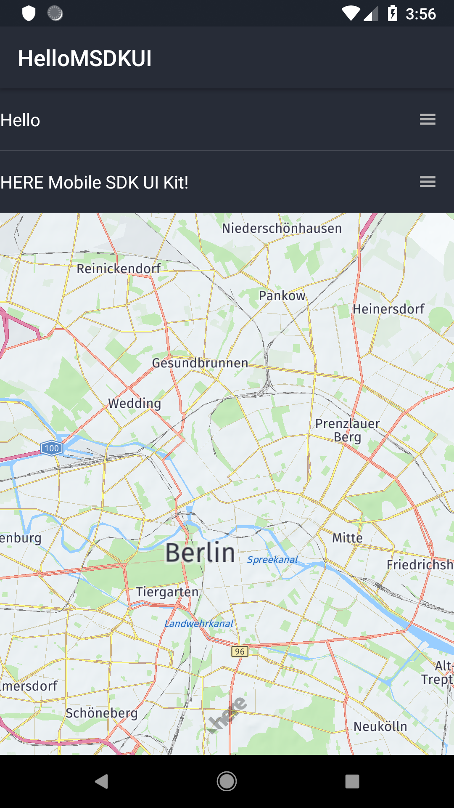

# Quick Start
Thank you for using the HERE Mobile SDK UI Kit (MSDKUI). In this Quick Start guide, we are going to introduce you to the HERE Mobile SDK UI Kit (MSDKUI) and show you how easy it is to get started. As a very first example, we'll also develop a "Hello HERE Mobile SDK UI Kit" Android application as part of this guide. For more examples and in-depth information on how to work with the HERE Mobile SDK UI Kit (MSDKUI) framework, please refer to the [User Guide](UserGuide.md).

## Contents

- [How to run the example apps](#how-to-run-the-example-apps)
- [How to run the Demo app](#how-to-run-the-demo-app)
- [Creating a new Android Project](#creating-a-new-android-project)
	- [Integrating the HERE Mobile SDK and the HERE Mobile SDK UI Kit (MSDKUI)](#integrating-the-here-mobile-sdk-and-the-here-mobile-sdk-ui-kit-msdkui)
	- [Gradle Setup](#gradle-setup)
	- [Theme Setup](#theme-setup)
	- [Setting your HERE Mobile SDK credentials](#setting-your-here-mobile-sdk-credentials)
	- [Add your first HERE Mobile SDK UI Kit (MSDKUI) component](#add-your-first-here-mobile-sdk-ui-kit-msdkui-component)
	- [Loading the Map](#loading-the-map)


## How to run the example apps
If you just want to try out the accompanying examples, please perform the following steps:

- Include the HERE Mobile SDK 3.19, Premium Edition, and the HERE Mobile SDK UI Kit (MSDKUI): Copy the `HERE-sdk.aar` and the `MSDKUILib-release.aar` to the example's _app/libs_ folder (if not done already, [build the MSDKUILib](ContributionGuide.md#building-the-here-ui-kit-library) via Gradle from folder _MSDKUIKit_ and make sure to copy the `HERE-sdk.aar` also to _MSDKUIKit/libs/_. Build the framework by executing: `./gradlew clean :MSDKUILib:assembleRelease`).
- Open the project in Android Studio.
- Add the credentials for the HERE Mobile SDK to the `AndroidManifest.xml` file:
```xml
<meta-data
   android:name="com.here.android.maps.appid"
   android:value="YOUR_APP_ID" />
<meta-data
   android:name="com.here.android.maps.apptoken"
   android:value="YOUR_APP_CODE" />
<meta-data
   android:name="com.here.android.maps.license.key"
   android:value="YOUR_APP_LICENSE" />
```

When you register on [developer.here.com](https://developer.here.com), the registered bundle identifier must match the [applicationId](https://developer.android.com/studio/build/application-id) in the app's build.gradle. For the example apps this is by default `com.here.msdkui.example` - you may need to adapt the `applicationId` to the one you have registered.

For more information on how to set up a new project, please, refer to our guide below which contains much more useful information on how to use the MSDKUI and to build your own apps.

> Please note that the HERE Mobile SDK UI Kit (MSDKUI) uses [AndroidX](https://developer.android.com/jetpack/androidx). You can migrate an existing project to AndroidX by selecting _Refactor > Migrate to AndroidX_ from the menu bar in Android Studio.

## How to run the Demo app
Along with the accompanying example apps and code snippets, we also provide a more complex demo app showing a complete and fully functional flow. If you want to try out the Demo application, please take a look at the [Contribution Guide](ContributionGuide.md).

If you want to build your own app, it may be useful to follow the guide below where we will develop step by step a first Hello HERE Mobile SDK UI Kit app in greater detail.

## Creating a new Android Project
Let's start by creating a new Android app. If you want to integrate the HERE Mobile SDK UI Kit (MSDKUI) into an existing app, you can skip this step. No HERE Mobile SDK or HERE Mobile SDK UI Kit (MSDKUI) specific code is involved here.
If you are new to Android development, please follow the guides on [developer.android.com](https://developer.android.com/guide/) to help you get started with the first steps.

For this Quick Start app, we used Android Studio 4.1.3.

- Start Android Studio and select _Start a new Android Studio project_.
- Select an Application name of your choice, for example _HelloMSDKUI_.
- Set a company name. For our example we have used _here.com_.
- Set a proper package name. Ideally, make sure that it matches the one used for your HERE credentials.
- This Quick Start guide uses Java, so do not include Kotlin support if you plan to use the same code snippets as provided within this guide. Note that the HERE Mobile SDK UI Kit (MSDKUI) is fully compatible with Kotlin. See also our HERE Mobile SDK UI Kit (MSDKUI) demo app which is developed in Kotlin.
- Select _Phone and Tablet_
- The minimum supported Android API level should be 19 (Android 4.4, KitKat) or higher.
- As a final step, select a template of your choice, for example _Empty Activity_ and keep the default name for your main activity on the next screen: _MainActivity_. To ensure backwards compatibility, we recommend using an `AppCompatActivity`.

Now let the Gradle sync finish and _run_ the project. Select an emulator or a real device and verify that your project executes as expected. If all goes well, you should see blank view showing a "Hello World"-text.

>**Note:** While all of the functionality of the HERE Mobile SDK UI Kit (MSDKUI) is accessible from the emulator, usage of a real device is strongly recommended. The overall performance will be better, and some features like gestures are just easier to use on multi-touch-enabled hardware.

### Integrating the HERE Mobile SDK and the HERE Mobile SDK UI Kit (MSDKUI)
Now that we have a working Android app, we can start integrating the HERE SDK and the HERE Mobile SDK UI Kit (MSDKUI) library. Make sure you have downloaded the latest HERE Mobile SDK release package including the library AAR artefact usually called `HERE-sdk.aar`.

As a next step, we will build the HERE Mobile SDK UI Kit library (MSDKUILib):
- Put the `HERE-sdk.aar` file from your HERE SDK package to _MSDKUI-Android/MSDKUIKit/libs/_.
- Build the MSDKUI library via Gradle: Navigate to the _MSDKUIKit_ folder and execute: `./gradlew clean :MSDKUILib:assembleRelease`.

>**Note:** Please, make sure to set `ANDROID_HOME` to your environment `PATH` variable. It should point to the location where you have installed the Android SDK.

The built HERE Mobile SDK UI Kit (MSDKUI) AAR is the located in your new _MSDKUIKit/MSDKUILib/build/outputs/aar/_ subfolder.

Now you should have two binaries: `HERE-sdk.aar` and `MSDKUILib-release.aar`. Copy both to the _libs_ folder of your Android project. Usually the path is inside the app folder, for example: `HelloMSDKUI/app/libs`.

More details on integrating the HERE Mobile SDK can be found on [developer.here.com](https://developer.here.com/documentation/android-premium/dev_guide/topics/quick-start.html). For this Quick Start guide, we will integrate the HERE SDK together with the MSDKUI lib. The steps are the same as shown on developer.here.com, except that we integrate the HERE Mobile SDK UI Kit (MSDKUI) on top.

### Gradle Setup
Within Android Studio, open the _app-level_ `build.gradle` file (to be found under the app folder) and configure the repositories for your project to use a flat hierarchy:

```java
repositories {
  flatDir {
    dirs 'libs'
  }
}
```

Extend the the dependencies closure and make sure it references the following libraries:

```java
dependencies {
    implementation fileTree(dir: 'libs', include: ['*.jar'])
    implementation 'androidx.appcompat:appcompat:1.2.0'
    implementation 'androidx.constraintlayout:constraintlayout:2.0.4'
    implementation 'com.google.android.material:material:1.3.0'
    implementation(name: 'HERE-sdk', ext: 'aar')
    implementation(name: 'MSDKUILib-release', ext: 'aar')
}
```

Depending on your specific project configuration, you may have other entries here. It is recommended to include always the latest versions.

As you can see, we add both the HERE Mobile SDK _and_ the MSDKUI library as dependencies. Additionally, the HERE Mobile SDK UI Kit (MSDKUI) requires the latest _AndroidX AppCompat support library_, the _Android Material Design library_ and the supporting _Constraint layout_. The latter two are needed for the layouts of certain HERE Mobile SDK UI Kit components.

Since the HERE Mobile SDK UI Kit (MSDKUI) uses Lambda expressions, _Java 8_ is required. Open the _app-level_ `build.gradle` file, if not already open. Please, add the following to the Android`-closure to [desugar](https://developer.android.com/studio/write/java8-support) the output of the javac compiler:
```java
    compileOptions {
        sourceCompatibility JavaVersion.VERSION_1_8
        targetCompatibility JavaVersion.VERSION_1_8
    }
```

### Theme Setup
The MSDKUI library offers various options to customize the default look and feel of its containing components. Make sure to derive your own themes from the `MSDKUIDarkTheme`. Other parent themes may be provided in the future. `MSDKUIDarkTheme` itself is derived from `Theme.AppCompat.Light.DarkActionBar`.

Overwrite the default `styles.xml` (to be found in `res/values`) to set a new base application theme:
```xml
    <style name="AppTheme" parent="MSDKUIDarkTheme">
        <!-- Customize your theme here. -->
    </style>
```

Note that this step is required even if you don't plan to use custom themes. The Add your first HERE Mobile SDK UI Kit (MSDKUI) component requires `MSDKUIDarkTheme` as parent theme for its components.

### Setting your HERE Mobile SDK credentials
The HERE Mobile SDK (Premium Edition) must be authenticated by providing a set of credentials specific for your project. If you don't know your credentials, please ask your HERE stakeholder or register on [developer.here.com](https://developer.here.com) and create new ones.

In order to enter the app id, app code and license key and to provide these to the HERE SDK, please open the `AndroidManifest`-file and edit the following entries. Note that the `meta-data` tags should be nested under the `application`-tag.

```xml
        <meta-data
            android:name="com.here.android.maps.appid"
            android:value="YOUR_APP_ID" />
        <meta-data
            android:name="com.here.android.maps.apptoken"
            android:value="YOUR_APP_CODE" />
        <meta-data
            android:name="com.here.android.maps.license.key"
            android:value="YOUR_LICENSE_KEY" />
```

Make sure to replace `YOUR_APP_ID`, `YOUR_APP_CODE` and `YOUR_LICENSE_KEY` with your own values.

>**Note:** If you want to try out our fully functional demo app or one of the [examples](../Guides_Examples), your [registered](https://developer.here.com) bundle identifier must match the [applicationId](https://developer.android.com/studio/build/application-id) in the app's build.gradle.

Since we are using the HERE Mobile SDK UI Kit (MSDKUI) along with the HERE Mobile SDK, we must make sure to add the required permissions to the manifest. The following permissions are recommended. Please put them nested under the `manifest`-tag:

```xml
    <uses-permission android:name="android.permission.ACCESS_FINE_LOCATION" />
    <uses-permission
        android:name="android.permission.WRITE_EXTERNAL_STORAGE"
        android:maxSdkVersion="28"
        tools:ignore="ScopedStorage" />
    <uses-permission android:name="android.permission.ACCESS_NETWORK_STATE" />
    <uses-permission android:name="android.permission.ACCESS_WIFI_STATE" />
    <uses-permission android:name="android.permission.INTERNET" />
```

As a minimum requirement we need access for storage and network, since the HERE Mobile SDK needs to download map data which must be cached for later use. Please, also add the optional `hardwareAccelerated`-attribute to your `application`-tag to benefit from certain hardware capabilities of a device for a better support of the Android 2D rendering pipeline:

```xml
android:hardwareAccelerated="true"
```

>**Note:** Additionally you can add a call to `MapSettings.setDiskCacheRootPath(String path)` with the desired cache location. It is recommended to set the disk cache location under your application directory if you do not want the cache to persist after your app is uninstalled. You can find an example [here](https://developer.here.com/documentation/android-premium/dev_guide/topics/map-service.html) or in the example app's `MapInitializer` helper class.

Finally make sure to click the _"Sync Project with Gradle Files"_-button. If all goes well, you should see the libraries embedded into your project. Switch to _"Project view"_ and expand the _"External Libraries"_-section. Make sure the following entries are shown:
- `HERE-sdk:@aar`
- `MSDKUILib:@aar`

To enable quick Javadoc reference within your Android Studio environment, scroll down to the _External Libraries_ section, right-click on `MSDKUILib:@aar`, and then select _Library Properties_. Click the `+`-button and locate `MSDKUILib-javadoc.jar` (if not done already, [build the MSDKUI API Reference](ContributionGuide.md#building-the-msdkui-api-reference-from-the-command-line) via Gradle: `./gradlew clean :MSDKUILib:javadocJar`).

### Add your first HERE Mobile SDK UI Kit (MSDKUI) component
If you succeed with the above steps, we have the MSDKUI library and the HERE Mobile SDK ready for use. Our app consists only of a single activity, accompanied by a layout file usually called `activity_main.xml` - if you kept the default `MainActivity` class name.

If you started with an empty Android project, the default layout was hosting a "Hello World"-`TextView`. Replace the entire content of the existing `activity_main` layout file with the following vertical `LinearLayout`:
```xml
<LinearLayout
    xmlns:android="http://schemas.android.com/apk/res/android"
    android:layout_width="match_parent"
    android:layout_height="match_parent"
    android:orientation="vertical">

    <com.here.msdkui.routing.WaypointList
        android:id="@+id/waypointList"
        android:layout_width="match_parent"
        android:layout_height="wrap_content"/>

    <fragment
        class="com.here.android.mpa.mapping.AndroidXMapFragment"
        android:id="@+id/mapFragment"
        android:layout_width="match_parent"
        android:layout_height="0dp"
        android:layout_weight="1"/>
</LinearLayout>
```
Our first HERE Mobile SDK UI Kit (MSDKUI) component for this example is `WaypointList` component. A `WaypointList` contains items describing waypoints for which a route can be calculated.  Since `WaypointList` is a direct child of `RecyclerView`, it behaves like you would expect from any other `RecyclerView`.
Below the `WaypointList` we show the HERE `AndroidXMapFragment`. Note that the map will occupy as much space as allowed by the `WaypointList`, since we are giving it a layout weight of 1.

### Loading the Map
Before we can start using the `WaypointList` component, we have to prepare loading the `AndroidXMapFragment`. As described on [developer.here.com](https://developer.here.com/documentation/android-premium/dev_guide/topics/app-create-simple.html), we have to request the required [Android permissions](https://developer.here.com/documentation/android-premium/topics/request-android-permissions.html) first. Then we can initialize the `AndroidXMapFragment`.

As our focus for this Quick Start guide is on using the HERE Mobile SDK UI Kit (MSDKUI) components, we have wrapped both steps in a helper class called `MapInitializer`. For implementation details, please check the example's code. You can use your own wrapper class or follow the steps on [developer.here.com](https://developer.here.com/documentation/android-premium/dev_guide/topics/app-create-simple.html).

Once the HERE `AndroidXMapFragment` is successfully loaded, we want to show a `Toast` message with the current version of the MSDKUI library:
```java
Toast.makeText(this, "HERE MSDK UI Kit version: " +
				com.here.msdkui.BuildConfig.VERSION_NAME, Toast.LENGTH_SHORT).show();
```

Now it's time to populate our first HERE Mobile SDK UI Kit (MSDKUI) component. For this Quick Start example, we just want to verify that we can access and use a HERE Mobile SDK UI Kit (MSDKUI) component. The `WaypointList` by default holds two empty waypoints. You can add more waypoints, remove waypoints or modify existing waypoints. A `WaypointList` can hold an unlimited number of stopovers, where the first waypoint marks the start of the route, while the last waypoint marks the destination of the route. For the sake of this Quick Start guide, we want to show the traditional "Hello World"-message by setting custom names for the waypoints.

```java
List<WaypointEntry> waypointEntries = new ArrayList<>();
waypointEntries.add(new WaypointEntry(new RouteWaypoint(
        new GeoCoordinate(52.53852, 13.42506)),
        "Hello"));
waypointEntries.add(new WaypointEntry(new RouteWaypoint(
        new GeoCoordinate(52.53853, 13.42507)),
        "HERE Mobile SDK UI Kit!"));

WaypointList waypointList = findViewById(R.id.waypointList);
waypointList.setEntries(waypointEntries);
```

The order in the array defines the order of how the waypoints shall appear in the `WaypointList`. However, the component also allows to interactively shuffle the waypoints around, using the right-hand drag handles - or do delete waypoints by tapping the _minus_ buttons on the left side.

The HERE Mobile SDK UI Kit (MSDKUI) uses the `WaypointEntry` class as a wrapper to hold coordinates that can be used for route calculation. By default, the component will show raw coordinate values, but you can also set custom names for each waypoint - for example street names. Here we use an overloaded constructor to directly pass in a `String` representation for each waypoint to split the "Hello HERE Mobile SDK UI Kit!"-message upon two waypoint entries.

By calling the `findViewById()`-method of our `Activity`, we lookup the inflated instance of our `WaypointList` and finally set the entries we want to show.

Now it's time to build and run the app. If all goes well, you should see a `WaypointList` covering the top area of the view, above a HERE `AndroidXMapFragment`.

<center><p>
  
</p></center>

Congratulations, you have successfully mastered your first steps in using the HERE Mobile SDK UI Kit (MSDKUI) for Android. If you want to see more examples and code snippets, please have a look at our [User Guide](UserGuide.md). Thank you!
