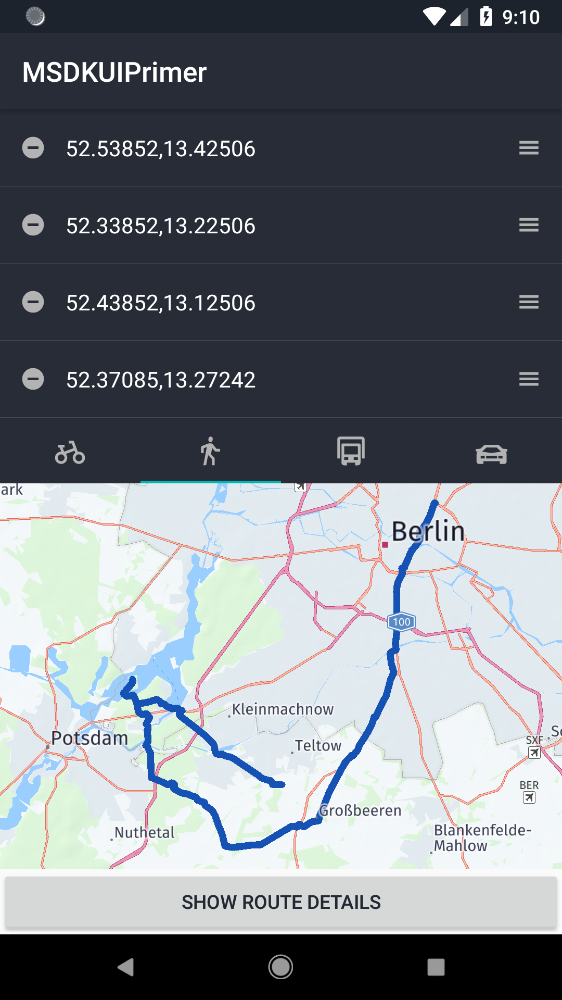
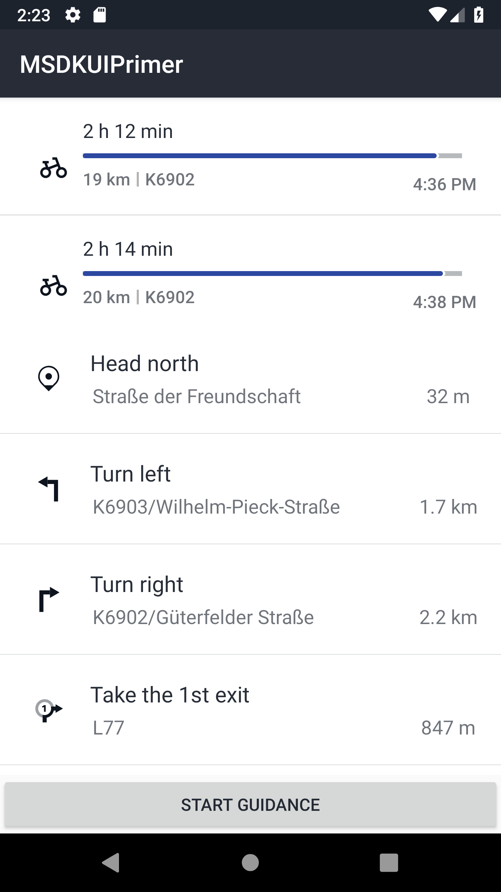
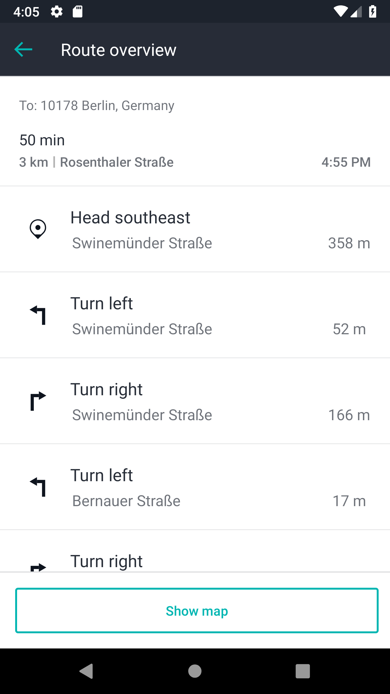

# HERE Mobile SDK UI Kit - User Guide
<!-- This guide's version is 1.3 and it is based on the HERE Mobile SDK 3.9 and HERE Mobile SDK UI Kit 2.0.-->
Are you looking for a framework that let's you build feature-rich and compelling user interfaces on top of the HERE Mobile SDK, _Premium_ edition? Then the HERE Mobile SDK UI Kit for iOS and Android is the perfect companion for you.

This user guide describes the general workflow using the HERE Mobile SDK UI Kit and its components in detail. If you are looking for a quick overview, please look at our [README](../../README.md), our [Quick Start](QuickStart.md) guide or the latest _Release Notes_.

## Contents
<!-- TOC depthFrom:2 depthTo:6 withLinks:1 updateOnSave:1 orderedList:0 -->

- [Why use the HERE Mobile SDK UI Kit?](#why-use-the-here-mobile-sdk-ui-kit)
- [Where to start?](#where-to-start)
- [How to read this guide?](#how-to-read-this-guide)
- [Getting Started - A HERE Mobile SDK UI Kit Primer](#getting-started-a-here-mobile-sdk-ui-kit-primer)
- [Overview of the HERE Mobile SDK UI Kit Primer example](#overview-of-the-here-mobile-sdk-ui-kit-primer-example)
- [Adding HERE Mobile SDK UI Kit components](#adding-here-mobile-sdk-ui-kit-components)
	- [Loading the map view](#loading-the-map-view)
- [Using the WaypointList](#using-the-waypointlist)
	- [Calculating the route](#calculating-the-route)
- [Using TransportModePanel](#using-transportmodepanel)
- [Implementing Route Details screen](#implementing-route-details-screen)
- [Using RouteDescriptionList](#using-routedescriptionlist)
- [Implementing Guidance screen](#implementing-guidance-screen)
- [Using GuidanceManeuverPanel](#using-guidancemaneuverpanel)
- [Where to go from here?](#where-to-go-from-here)

<!-- /TOC -->

## Why use the HERE Mobile SDK UI Kit?
The HERE Mobile SDK UI Kit provides highly flexible and customizable User Interface building blocks that can be freely combined and arranged with your own UI components - with just a few lines of code.

The HERE Mobile SDK UI Kit builds upon optimized native platform code to fully support Xcode's _Interface Builder_ and Android Studio's _Layout Editor_ resulting in reduced development time and a faster time to market for your apps.

- **Cleaner code:** By using the HERE Mobile SDK UI Kit's already assembled modular high- and low-level components, you can easily decouple existing (or new) HERE Mobile SDK logic from your UI modules and other parts of your application.

- **Easy to learn:** Each prebuilt component allows for straight-forward customization, either by switching on/off a predefined set of styles or by customizing the views programmatically. As each component is based on platform code, it behaves exactly like you would expect from any other native UI component you may have already in use.

- **Flexible:** All HERE Mobile SDK UI Kit components can be independently integrated from each other - allowing extensible cutting-edge user interfaces. Imagine an interactive route summary mixed with customized planning options directly showing the route to your facility? Or presenting route maneuvers based on the user's traffic preference on the same view? No matter what kind of user flow you want to create, with the HERE Mobile SDK UI Kit it is now all in your hands - making the HERE Mobile SDK a more powerful development tool than ever before.

With the HERE Mobile SDK UI Kit, realizing complete apps including comprehensive route planning and state-of-the-art guidance becomes a matter of minutes. While hiding the underlying complexity, you still have all the freedom you need to build unique and powerful apps - take a quick tour with our [HERE Mobile SDK UI Kit Primer](#getting-started-a-here-mobile-sdk-ui-kit-primer) to see a practical example.

Version 1.x of the HERE Mobile SDK UI Kit mainly focuses on enabling user experiences related to route planning and guidance. The HERE Mobile SDK UI Kit components are available for iOS and Android, supporting Java and Kotlin on Android, likewise Swift on iOS.

## Where to start?
- If you haven't done so, please read our [Quick Start](QuickStart.md) guide to see how you can integrate the HERE Mobile SDK UI Kit into your own apps.
- Check the _API Reference_ that can be built locally using the command line, see [Contribution Guide](ContributionGuide.md).
- You can also find:
  - Numerous [examples](../Guides_Examples/) accompanying this user guide
  - A HERE MSDK UI [demo app](../../MSDKUIDemo/) showcasing most features of the HERE Mobile SDK UI Kit in production-ready quality
- Read the [HERE Mobile SDK UI Kit Primer](#getting-started-a-here-mobile-sdk-ui-kit-primer) chapter of this user guide.

## How to read this guide?
In the following sections we will guide you through the most common usage scenarios and reveal tips and easy-to-understand guidelines to help you get the most out of using the HERE Mobile SDK UI Kit for Android. All _main_ sections can be read independent from each other, so you can skip any section and dive straight into the topics you are most interested in.

>**Note:** All examples that are built as part of this user guide are optimized for portrait mode to keep the projects light weighted and focused. The HERE Mobile SDK UI Kit fully supports portrait _and_ landscape mode. Adapting user interfaces for specific resolutions and orientations depends on your specific requirements - and taste - which is beyond the scope of this document. If supporting landscape requires specific attention or differs from standard Android behavior, it is noted down - otherwise not.

All HERE Mobile SDK UI Kit components support initialization from layouts or by code (programmatically). For most examples, we recommend using layouts. As you can use HERE Mobile SDK UI Kit components like any other view or 3rd party custom component, the general workflow does not contain any specific treatment. If you are new to working with views and layouts under Android, we recommend to read Android's [Layout Guide](https://developer.android.com/guide/topics/ui/declaring-layout).

## Getting Started - A HERE Mobile SDK UI Kit Primer
In this short tutorial, we are guiding you through your first application with the HERE Mobile SDK UI Kit. We are creating a small route planning application and provide reusable code snippets and guidelines on how to avoid the most common pitfalls. The resulting app is kept as simple as possible - feel free to modify or extend it based on your own taste and needs.

>**Note:** For integrating the HERE Mobile SDK UI Kit framework, please have a look at our [Quick Start](QuickStart.md) to safely guide you through the first steps.

You can find the complete example code of the _MSDKUIPrimer_ app in the [examples section](../Guides_Examples/). We recommend that you follow this tutorial step-by-step. However, if you get stuck or if you just want to inspect the resulting code of this tutorial, please refer to the app as a point of reference.

## Overview of the HERE Mobile SDK UI Kit Primer example
The HERE Mobile SDK UI Kit Primer example app consists of three screens illustrating some of the main HERE Mobile SDK UI Kit components _in action_:

**Main Screen** (`MainActivity.java`)
- Shows a programmatically pre-populated `WaypointList`
- A `TransportModePanel` to select a transport mode and to trigger immediate route calculation
- A `MapFragment` to show the calculated route and zoom to selected waypoints
- An Android `Button` to navigate to the next screen

**Route Details Screen** (`RouteDetailsActivity.java`)
- Contains a `RouteDescriptionList` to select a route (if more than one route was found)
- A `ManeuverDescriptionList` to show the maneuvers of the selected route
- An Android `Button` to navigate to the next screen

**Guidance Screen** (`GuidanceActivity.java`)
- Shows a `GuidanceManeuverPanel` to indicate the next maneuvers
- A `MapFragment` to show the current position and orientation on the map
- An Android `Button` to stop guidance

First we need to create a new Android project, integrate the HERE Mobile SDK and the HERE Mobile SDK UI Kit. If you followed the [Quick Start](QuickStart.md) guide, you have already created a `MainActivity` as the main entry point to your application. If you prefer, you can also integrate this example into an existing application. The following steps will remain the same.

## Adding HERE Mobile SDK UI Kit components
Let's add the first HERE Mobile SDK UI Kit components to our new project. As outlined before, we want to show two HERE Mobile SDK UI Kit components on our `MainActivity`:
- `WaypointList`
- `TransportModePanel`

For this example, we use a `LinearLayout` as parent layout to group our components vertically. Feel free to use other ViewGroups as layout parent for your own apps. At least, make sure the layout of your main activity contains the same components as shown below:
```xml
<LinearLayout
    xmlns:android="http://schemas.android.com/apk/res/android"
    android:layout_width="match_parent"
    android:layout_height="match_parent"
    android:orientation="vertical" >

    <com.here.msdkui.routing.WaypointList
        android:id="@+id/waypointList"
        android:layout_width="match_parent"
        android:layout_height="wrap_content"/>

    <com.here.msdkui.routing.TransportModePanel
        android:id="@+id/transportModePanel"
        android:layout_width="match_parent"
        android:layout_height="wrap_content"/>

    <fragment
        class="com.here.android.mpa.mapping.MapFragment"
        android:id="@+id/mapFragment"
        android:layout_width="match_parent"
        android:layout_height="0dp"
        android:layout_weight="1"/>

    <Button
        android:layout_width="match_parent"
        android:layout_height="wrap_content"
        android:text="Show route details"
        android:onClick="onRouteDetailsButtonClick"/>
</LinearLayout>
```

For this layout we have nested four components ordered from top to bottom:
- A HERE Mobile SDK UI Kit component: `WaypointList`
- A HERE Mobile SDK UI Kit component: `TransportModePanel`
- A `MapFragment` to show a route
- A `Button` to advance to the next activity

Note that all components share the same namespace `com.here.msdkui.<name_of_module>`. In this case, both components belong to the `routing` module.
Since all HERE Mobile SDK UI Kit components are direct or indirect children of `View`, they behave like any other `View` component.

### Loading the map view
Before we can start using our HERE Mobile SDK UI Kit components, please make sure to initialize the HERE MapFragment as shown in our [Quick Start](QuickStart.md) guide. We use a wrapper class called `MapInitializer` to request the required Android permissions and load the MapFragment:
```java
mapInitializer = new MapInitializer(this, this::onMapLoaded);
```

Alternatively, you can use your own wrapper class or follow the steps on [developer.here.com](https://developer.here.com/documentation/android-premium/dev_guide/topics/app-create-simple.html). Please find the implementation details of how to initialize a HERE `MapFragment` in the source code of the example - or look for other HERE SDK examples on [GitHub](https://github.com/heremaps/here-android-sdk-examples). This step does not involve any HERE Mobile SDK UI Kit specific actions.

Usually, loading the map can take place in your Activity's `onCreate()`-method. Once the map is successfully loaded, we can access our inflated HERE Mobile SDK UI Kit components:
```java
private WaypointList waypointList;
private TransportModePanel transportModePanel;
private Map map;

private void onMapLoaded(Map hereMap) {
    waypointList = findViewById(R.id.waypointList);
    transportModePanel = findViewById(R.id.transportModePanel);
    map = hereMap;
}
```

## Using the WaypointList
Now we have references to our components at hand, so we can start using them and attach the behavior we desire. For this Primer tutorial, we want to add a few waypoints programmatically.

HERE Mobile SDK UI Kit provides the `WaypointEntry` class as a wrapper to allow modification of certain attributes, so that you can set - for example - street names for each waypoint instead of showing the raw coordinates (default). Please see the [Quick Start](QuickStart.md) guide for an example.
```java
List<WaypointEntry> waypointEntries = new ArrayList<>();
waypointEntries.add(new WaypointEntry(new RouteWaypoint(new GeoCoordinate(52.53852,13.42506))));
waypointEntries.add(new WaypointEntry(new RouteWaypoint(new GeoCoordinate(52.33852,13.22506))));
waypointEntries.add(new WaypointEntry(new RouteWaypoint(new GeoCoordinate(52.43852,13.12506))));
waypointEntries.add(new WaypointEntry(new RouteWaypoint(new GeoCoordinate(52.37085,13.27242))));
```

As a next step, we need to add the `WaypointEntry` objects to the `WaypointList`. Since we added four waypoints, based on our layout only some may be visible, so the user may need to scroll through the list to see all waypoints.
```java
waypointList.setEntries(waypointEntries);
```

Note that order matters, but don't worry, the `WaypointList` HERE Mobile SDK UI Kit component by default already provides drag handles to change the order afterwards.

However, we also want to get notified, whenever the user did any interaction with the `WaypointList`. Therefore we can attach a listener to the `WaypointList`. It provides the following callbacks:

- `onEntryClicked(int index, WaypointEntry waypointEntry)`: Occurs when a user taps on a waypoint.
- `onEntryAdded(int index, WaypointEntry waypointEntry)`: Occurs when a new waypoint was added programmatically.
- `onEntryUpdated(int index, WaypointEntry waypointEntry)`: Occurs when the waypoint contents have been updated.
- `onEntryRemoved(int index, WaypointEntry waypointEntry)`: Occurs when a waypoint was removed programmatically or via the minus button.
- `onEntryDragged(int fromIndex, int toIndex)`: Occurs when a waypoint was dragged to a new position.

By default the `WaypointList` component provides a user interface that allows the user to:
- Drag a waypoint via the _drag handles_ on the right side
- Remove a waypoint by clicking the _minus_ button on the left side

Note that the _minus_ buttons appear only when there are more than two waypoints available.

To start listening for the first events, we need to set a new `WaypointList.Listener`:
```java
waypointList.setListener(new WaypointList.Listener() {
    @Override
    public void onEntryClicked(int index, WaypointEntry waypointEntry) {
        Log.d(LOG_TAG, "WaypointList: onEntryClicked");
        map.setZoomLevel(14);
        map.setCenter(waypointEntry.getRouteWaypoint().getOriginalPosition(), Map.Animation.BOW);
    }

    @Override
    public void onEntryAdded(int index, WaypointEntry waypointEntry) {
        Log.d(LOG_TAG, "WaypointList: onEntryAdded");
    }

    @Override
    public void onEntryUpdated(int index, WaypointEntry waypointEntry) {
        Log.d(LOG_TAG, "WaypointList: onEntryUpdated");
        calculateRoutes();
    }

    @Override
    public void onEntryRemoved(int index, WaypointEntry waypointEntry) {
        Log.d(LOG_TAG, "WaypointList: onEntryRemoved");
        calculateRoutes();
    }

    @Override
    public void onEntryDragged(int fromIndex, int toIndex) {
        Log.d(LOG_TAG, "WaypointList: onEntryDragged");
        calculateRoutes();
    }
});
```

We implemented the following behavior:
- When a waypoint is selected, we want to zoom to the waypoint's position and make it the center of our map
- When a waypoint is removed, we want to calculate a new route
- When a waypoint is dragged, we also want to calculate a new route

### Calculating the route
Since we integrated a HERE `MapFragment`, we can easily show a new route on it. For route calculation, we use the HERE Mobile SDK's [core router](https://developer.here.com/documentation/android-premium/api_reference_java/com/here/android/mpa/routing/CoreRouter.html). If you are interested in the implementation details, please have a look at the example code. For the purpose of this guide, we only need to be aware that route calculation requires `RouteWaypoint` objects and `RouteOptions` containing details about the desired route. For example, a travel date, traffic options or a transport mode. For the sake of simplicity, for this Primer app we only provide a transport mode option. The `RouteWaypoint` list and the transport mode can easily be retrieved like:
```java
List<RouteWaypoint> waypoints = waypointList.getRouteWaypoints();
TransportMode transportMode = transportModePanel.getSelectedTransportMode();
```

Note that we show a route on the map once route calculation is completed. In this example, we show only the first calculated route - even if more routes could be found.

## Using TransportModePanel
As mentioned in the previous section, we want to calculate a route for a specific transportation mode. Therefore we have added the `TransportModePanel` HERE Mobile SDK UI Kit component. By default it shows all supported transportation modes:
- `RouteOptions.TransportMode.CAR`
- `RouteOptions.TransportMode.TRUCK`
- `RouteOptions.TransportMode.PEDESTRIAN`
- `RouteOptions.TransportMode.BICYCLE`
- `RouteOptions.TransportMode.SCOOTER`

>**Note:** If you plan to add `TransportMode.SCOOTER`, please, make sure to extend your HERE Mobile SDK license key - if not done already.

The `TransportModePanel` can be used to change the `RouteOptions` that can be used for route calculation.
```java
RouteOptions routeOptions = new RouteOptions();
routeOptions.setRouteCount(5);
routeOptions.setTransportMode(transportModePanel.getSelectedTransportMode());
```

Here we create a `routeOptions` variable and accept a maximum of 5 different route results.

The `TransportModePanel` can be customized by setting the desired transport modes to a custom `TransportModePanelAdapter`. In the following code snippet, we change the default order to start with `bike` first and omit the `scooter` transport mode:
```java
transportModePanel.setAdapter(
        new SimpleTransportModePanelAdapter(this, Arrays.asList(
                RouteOptions.TransportMode.BICYCLE,
                RouteOptions.TransportMode.PEDESTRIAN,
                RouteOptions.TransportMode.TRUCK,
                RouteOptions.TransportMode.CAR)));
```

Since the `TransportModePanelAdapter` is abstract, you can use the convenience implementation `SimpleTransportModePanelAdapter`. Note that you do not need to set an adapter if you are fine with the default transport modes.

You can also define which button should be highlighted. Below, we choose the transport mode `CAR` to be used by default for route calculation:
```java
transportModePanel.setSelectedTransportMode(RouteOptions.TransportMode.CAR);
```

By setting a listener, we can get notified whenever a user tapped a transport mode button:
```java
transportModePanel.setOnSelectedListener(new TransportModePanel.OnSelectedListener() {
    @Override
    public void onSelected(int index, TabView tabView) {
        Log.d(LOG_TAG, "TransportModePanel: onSelected");
        calculateRoutes();
    }

    @Override
    public void onUnselected(int index, TabView tabView) {
        Log.d(LOG_TAG, "TransportModePanel: onUnselected");
    }

    @Override
    public void onReselected(int index, TabView tabView) {
        Log.d(LOG_TAG, "TransportModePanel: onReselected");
    }
});
```

As you can see, the first callback notifies us that a new `TransportMode` was selected, which will then be used to calculate a new route. On opposition `onReselected()` notifies us when the same button was tapped again: In this case we do not start route calculation again.

The screenshot shows how the updated `MainActivity` could look like:

<center><p>
  
</p></center>

## Implementing Route Details screen
In the previous screen the user was able to calculate a route based on her or his waypoint selection and a suitable route mode. Now we want to show a summary for the found routes and their maneuvers on a new screen. As described above, we will show this in the `RouteDetailsActivity` of our HERE Mobile SDK UI Kit Primer example app. The `RouteDetailsActivity` controller holds two HERE Mobile SDK UI Kit components:
- `RouteDescriptionList`: Shows all found routes as a summary in a scrollable list
- `ManeuverDescriptionList`: Shows all maneuvers belonging to a route

First, we need to set up our layout:
```xml
<LinearLayout
    xmlns:android="http://schemas.android.com/apk/res/android"
    android:layout_width="match_parent"
    android:layout_height="match_parent"
    android:orientation="vertical" >

    <com.here.msdkui.routing.RouteDescriptionList
        android:id="@+id/routeDescriptionList"
        android:layout_width="match_parent"
        android:layout_height="0dp"
        android:layout_weight="1"/>

    <com.here.msdkui.routing.ManeuverDescriptionList
        android:id="@+id/maneuverDescriptionList"
        android:layout_width="match_parent"
        android:layout_height="0dp"
        android:layout_weight="2"/>

    <Button
        android:layout_width="match_parent"
        android:layout_height="wrap_content"
        android:text="Start guidance"
        android:onClick="onStartGuidanceButtonClick"/>
</LinearLayout>
```

For this example we show both components on one screen, giving the `ManeuverDescriptionList` 2/3 of the available space, since the `RouteDecriptionList` is expected to show only up to five routes.

You may look at our demo app for an alternative user interface approach. Note that the HERE Mobile SDK UI Kit does not promote any specific flow how it's component must be arranged - it all depends on your specific needs and taste.

Again, we retrieve our components from layout in the Activity's `onCreate()`-method:
```java
routeDescriptionList = findViewById(R.id.routeDescriptionList);
maneuverDescriptionList = findViewById(R.id.maneuverDescriptionList);
```

## Using RouteDescriptionList
Firstly, we use the routes calculated from the previous screens and check if we have routes to show. As we have pre-filled the `WaypointList`, we most likely will have at least one route to show. For example, if a route may not be found when crossing the ocean, you may want to let the `RouteDescriptionList` component indicate a localized message that _no routes_ are set:
```java
outeDescriptionList.setRoutes(new ArrayList<>());
```

>**Note:** that the appearing message does not promote any specific reason why there is no route - and by default, no routes are set to the component. It is a good habit to bring back the default state by setting an empty array once route calculation has failed.

If we have some routes to show, we can set them like:
```java
routeDescriptionList.setRoutesResult(RouteCalculator.getInstance().lastCalculatedRouteResults);
```

Note that we use a `RouteCalculator` convenience class to access the last calculated routes. If you are interested in the implementation details, please have a look at the example code.

Since we want to get notified once a user selects a route, we can set a `CustomRecyclerView.OnItemClickedListener`. The `RouteDescriptionList` is a child of a `CustomRecyclerView` which derives from `RecyclerView`. To simplify usage, the HERE Mobile SDK UI Kit provides a `CustomRecyclerView` which allows click handling on list items:
```java
routeDescriptionList.setOnItemClickedListener(new CustomRecyclerView.OnItemClickedListener() {
    @Override
    public void onItemClicked(int index, View view) {
        RouteDescriptionItem routeDescriptionItem = (RouteDescriptionItem) view;
        Route selectedRoute = routeDescriptionItem.getRoute();
        maneuverDescriptionList.setRoute(selectedRoute);

        RouteCalculator.getInstance().selectedRoute = selectedRoute;
        Log.d(LOG_TAG, "Selected route: " + selectedRoute.toString());
    }

    @Override
    public void onItemLongClicked(int i, View view) {
    }
});
```

As our goal is to select a route and to see all the maneuvers of that route, we have to set the selected route to the `maneuverDescriptionList`. Since we receive the selected `Route` from the callback (as shown above) we can set it as new `route` to `ManeuverDescriptionList`:
```java
Route selectedRoute = routeDescriptionItem.getRoute();
maneuverDescriptionList.setRoute(selectedRoute);
```

<center><p>
  
</p></center>


Like for all HERE Mobile SDK UI Kit's list components, we can get notified once a user selects a specific maneuver by tapping on it. In order to react on this event we set the `CustomRecyclerView.OnItemClickedListener()` to know when an item of the list was clicked:
```java
maneuverDescriptionList.setOnItemClickedListener(new CustomRecyclerView.OnItemClickedListener() {
    @Override
    public void onItemClicked(int index, View view) {
        ManeuverDescriptionItem maneuverDescriptionItem = (ManeuverDescriptionItem) view;
        Log.d(LOG_TAG, "Selected maneuver: " + maneuverDescriptionItem.getManeuver().toString());
    }

    @Override
    public void onItemLongClicked(int i, View view) {
    }
});
```

## Implementing Guidance screen
To finish our quick overview, we want to use the selected route from the previous step to start guidance along that route. For this, we only need one new HERE Mobile SDK UI Kit component:
- `GuidanceManeuverPanel`

In addition, we also want to show a map during guidance to let the user orientate where we currently are. This results in the following vertical `LinearLayout`, where the `GuidanceManeuverPanel` is placed above the `MapFragment`:
```xml
<LinearLayout
    xmlns:android="http://schemas.android.com/apk/res/android"
    android:layout_width="match_parent"
    android:layout_height="match_parent"
    android:orientation="vertical" >

    <com.here.msdkui.guidance.GuidanceManeuverPanel
        android:id="@+id/guidanceManeuverPanel"
        android:layout_width="match_parent"
        android:layout_height="wrap_content"/>

    <fragment
        class="com.here.android.mpa.mapping.MapFragment"
        android:id="@+id/mapFragment"
        android:layout_width="match_parent"
        android:layout_height="0dp"
        android:layout_weight="1"/>

    <Button
        android:layout_width="match_parent"
        android:layout_height="wrap_content"
        android:text="Stop guidance"
        android:onClick="onStopGuidanceButtonClick"/>
</LinearLayout>
```

## Using GuidanceManeuverPanel
The `GuidanceManeuverPanel` is a panel where information about the next maneuvers will appear. As with all HERE Mobile SDK UI Kit components, it is already configured, so you only need to pass in the current `GuidanceManeuverData`.

This data is provided by the `GuidanceManeuverPanelPresenter` helper class, that accepts a `GuidanceManeuverPanelListener` to notify the listener once new `GuidanceManeuverData` is available:
```java
guidanceManeuverPanel = findViewById(R.id.guidanceManeuverPanel);
guidanceManeuverPanelPresenter = new GuidanceManeuverPanelPresenter(this, NavigationManager.getInstance(), route);
guidanceManeuverPanelPresenter.addListener(new GuidanceManeuverPanelListener() {
    @Override
    public void onDataChanged(@Nullable GuidanceManeuverData guidanceManeuverData) {
        if (guidanceManeuverData != null) {
            Log.d(LOG_TAG, "onDataChanged: 1st line: " + guidanceManeuverData.getInfo1());
            Log.d(LOG_TAG, "onDataChanged: 2nd line: " + guidanceManeuverData.getInfo2());
        }
        guidanceManeuverPanel.setManeuverData(guidanceManeuverData);
    }

    @Override
    public void onDestinationReached() {
        Log.d(LOG_TAG, "onDestinationReached");
        guidanceManeuverPanel.highLightManeuver(Color.BLUE);
    }
});
```

While the first callback simply sets the received `GuidanceManeuverData` to the `GuidanceManeuverPanel`, the latter informs us when the user has finally reached the destination. In this case, we choose to highlight the last maneuver.

Note that we must resume the `GuidanceManeuverPanelPresenter` to receive guidance events: As we already passed the `NavigationManager` singleton and the route object to the constructor of the `GuidanceManeuverPanelPresenter`, we only have to call `resume()` to start listening - and to call `pause()` to stop listening. Please, also make sure to declare the presenter as member variable - otherwise you will not receive any events once the scope of the calling method was executed.
```java
private void startGuidanceSimulation() {
    guidanceManeuverPanelPresenter.resume();
    GuidanceSimulator.getInstance().startGuidanceSimulation(route, map);
}

private void stopGuidanceSimulation() {
    guidanceManeuverPanelPresenter.pause();
    GuidanceSimulator.getInstance().stopGuidance();
}
```

Since we passed the `route` that should be used for guidance to the `GuidanceManeuverPanelPresenter`, the presenter is then taking care of forwarding any navigation events - allowing us to intercept the current `GuidanceManeuverData` if desired. In our implementation we simply set the current `guidanceManeuverData` to the `GuidanceManeuverPanel`, so the user can see which turn to take next.

>**Note:** The current `guidanceManeuverData` can be `null`. If `null` is passed to `guidanceManeuverPanel.setManeuverData()`, then the panel will show a loading state - indicating that there is currently no data to show. In case you want to stick with the default behavior, you can simply pass `guidanceManeuverData` - regardless if it is `null` or not. If you want to change the default behavior, you can set a customized `GuidanceManeuverData` instance. Please note, before starting the trip, no initial maneuver data may be present. In such a case, the panel shows a suitable default instruction, like "Follow the route on the map", until the first maneuver data - whether `null` or not - is provided.

Once we resume the `GuidanceManeuverPanelPresenter`, we may also want to start guidance. For this example we are calling the helper method `GuidanceSimulator.getInstance().startGuidanceSimulation(route, map);`. Notice that you can use the HERE Mobile SDK to start _simulated_ guidance. For implementation details, please check the example's code. During the development phase, it is usually more convenient to simulate the navigation experience along the provided route - so that we can quickly see how the `GuidanceManeuverPanel` changes it's content in real-time.

<center><p>
  
</p></center>

More information on how to start guidance using the HERE Mobile SDK is described on [developer.here.com](https://developer.here.com/documentation/android-premium/topics/map-guidance.html).

## Where to go from here?
Congratulations, by following this HERE Mobile SDK UI Kit Primer tutorial, you have discovered the basic HERE Mobile SDK UI Kit components and how they can work together to build extremely powerful apps. Please take a look at the _API Reference_ to learn more about the various HERE Mobile SDK UI Kit components.

There you can also find more example code, and our demo application that shows most of the available HERE Mobile SDK UI Kit components and capabilities.

|  |  |  |
|:---:|:---:|:---:|
| **Main Screen** | **Route Description Screen** | **Maneuver Screen** |

The screenshots above show the "MSDK UI Demo" app.

We are happy to hear your feedback. Please [contact us](https://developer.here.com/contact-us) for any questions, suggestions or improvements. Thank you for using the HERE Mobile SDK UI Kit.
