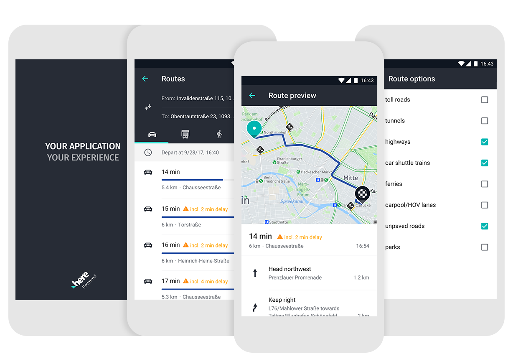

# What is the HERE Mobile SDK UI Kit (MSDKUI)?
The HERE Mobile SDK UI Kit (MSDKUI) is a framework that provides modular and highly customizable user interface components that can be used on top of the HERE SDKs for iOS and Android ([Premium Edition](https://developer.here.com/develop/mobile-sdks)).

Rapidly build beautiful UIs for common use cases and scenarios within minutes. Version 2.x of the HERE Mobile SDK UI Kit (MSDKUI) will mainly focus on route planning, maneuver details and guidance. More components will follow subsequently with the next releases.

## Feature List
- Modular UI building blocks
- Native support for iOS and Android (including _Interface Builder_ on iOS and _Layout Editor_ on Android Studio)
- Ready-made styles for each component, adaptable on-the-fly
- Full support for all device orientations and screen sizes
- Already localized for 14+ languages
- Full accessibility support including voice over for customers with special needs
- Designed for the HERE SDKs for iOS and Android ([Premium Edition](https://developer.here.com/develop/mobile-sdks)).

## Component Overview
The HERE Mobile SDK UI Kit (MSDKUI) comes with various high- and low-level components supporting core use cases around the HERE Mobile SDK. Along with these components we deliver a rich set of supportive controls and tailored data structures to further reduce your development cost. All components can be freely arranged in your layouts and are highly customizable. More components will be delivered as part of the next releases. We already provide UI-centric support for the following features:

##### Route Planner
- Waypoint list (start,  stop, incl. support for stopovers, drag & drop sorting)
- Transport mode panel (to select transport type)
- Traffic options panel
- Different route options (including different sub-views for trucks like tunnel or hazardous goods)
- Travel time options and picker (to select departure or arrival times)

##### Route Summary
- Route description item (shows localized route details including user options)
- Route description list (shows alternative routes in an overview)

##### Route Maneuver
- Localized maneuver instructions and icons assembled out of the raw route data
- Maneuver item view (shows actions and turns)
- Maneuver list (shows maneuver details of a route in an overview)

##### Guidance
- Localized guidance instructions and icons assembled out of the raw route data
- Guidance maneuver view to show upcoming actions and turns during navigation - an additional component is available to show the maneuver actions after the next maneuver
- Guidance street label (shows information about the street a driver is currently on)
- Guidance estimated arrival view (displays estimated arrival information, such as estimated arrival time (ETA), estimated time to destination, and remaining travel distance)
- Guidance speed / guidance speed limit views (current speed and speed limit information)

## Localization
The HERE Mobile SDK UI Kit is already fully localized for the following languages:

- Chinese (Taiwan)
- English (UK)
- English (US)
- Filipino
- French
- German
- Hindi
- Italian
- Polish
- Portuguese (Brazil)
- Spanish (Spain)
- Turkish
- Ukrainian
- Vietnamese

## Supported platforms
The HERE Mobile SDK UI Kit (MSDKUI) components are available for Android and [iOS](https://github.com/heremaps/msdkui-ios). The required HERE Mobile SDK is Version 3.19, only the _Premium edition_ is supported. The HERE Mobile SDK UI Kit supports scooter routing. Please, make sure to extend your license key if you want to include scooter routing in your app.

**Android Environment**
- Minimum supported API version is 19 (KitKat), allowing you to reach more than 95% of all Android devices.
- The Android Support Library is required, please always use to the latest one.
- We recommend using Android Studio 4.1.3.
- [AndroidX](https://developer.android.com/jetpack/androidx) is required.

## Quick Start
Please have a look at our [Quick Start](Documentation/Guides/QuickStart.md) tutorial to see how easy it is to integrate the HERE Mobile SDK UI Kit (MSDKUI) into your own apps. More information on how to use the HERE Mobile SDK UI Kit (MSDKUI) can be found in our [User Guide](Documentation/Guides/UserGuide.md). Information on how to contribute to this project can be found in our [Contribution Guide](Documentation/Guides/ContributionGuide.md).

## Documentation
- The latest API Reference can be found [here](https://heremaps.github.io/msdkui-android/).
- _Release Notes_: All recent additions, more details about the current release and the differences to previous versions can be found in the _Release Notes_.
- You can find various _examples_ and _code snippets_ accompanying the Developer's Guide.
- A more complex and fully functional _demo app_ can be found in this repository.

## Maintenance Notice

The MSDKUI project will be discontinued as it is incompatible with the new [4.x HERE SDK](https://developer.here.com/products/here-sdk) releases. The HERE team does not plan any additional feature implementation for the future. This repository will stay online and it can still be forked and used for commercial or non-commercial projects, but we plan only _limited maintenance work_ from now on. We recommend all users to [migrate](https://developer.here.com/documentation/android-sdk-navigate/4.7.0.0/dev_guide/topics/migration.html) to the new 4.x HERE SDK releases. Thanks to all users who contributed to the MSDKUI project!

## Get in Touch
We are happy to hear your feedback. Please [contact us](https://developer.here.com/contact-us) for any questions, suggestions or improvements. Thank you for your using the HERE Mobile SDK UI Kit (MSDKUI).

## License
Copyright (c) 2017-2021 HERE Europe B.V.

See the [LICENSE](LICENSE) file in the root of this project for license details.
